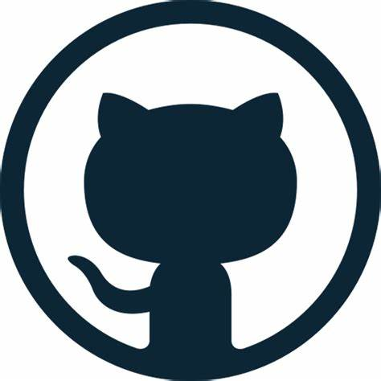

# naveenr1099
## my name is Naveen R.

### Hi there 👋,
### My main interest in Machine Learning. I also have basic knowledge of Docker. I am always exciting to learn something new.
Skills: HTML/CSS/JS

*  🔭 I’m currently studing in final semester.
*  🌱 I’m currently learning on best practices for HTML&CSS.
*  💭 I’m looking to Intrested on Web Development project.
*  🤔 I’m looking for help with  Docker 
*  💬 Ask me about  OpenCV, HTML or ML. 
*  📫 How to reach me: Contact me directly on this mail naveenr1099@gmail.com.
*  😄 Pronouns: I can give one.
*  🎳 **HOBBIES:** I can playing Cricket

 
  
